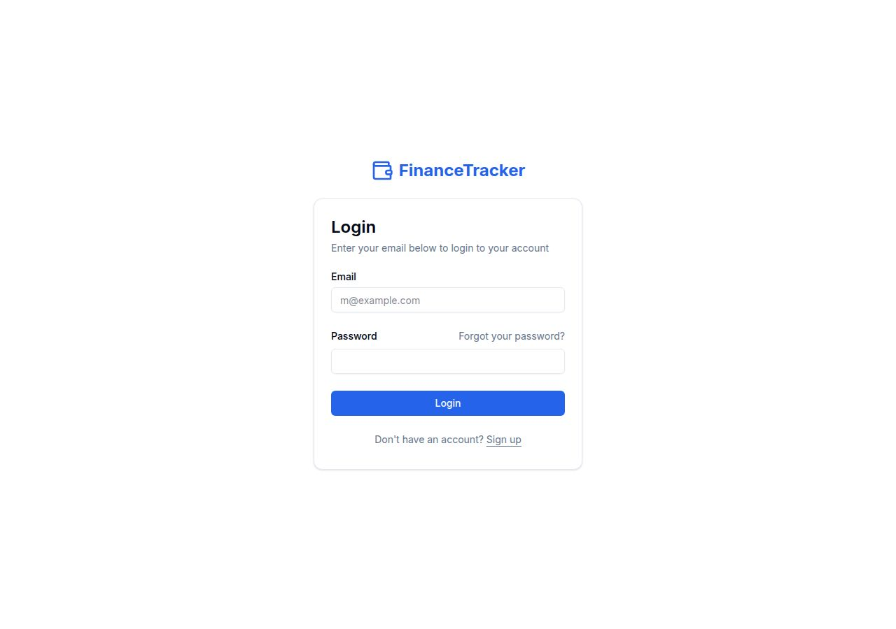
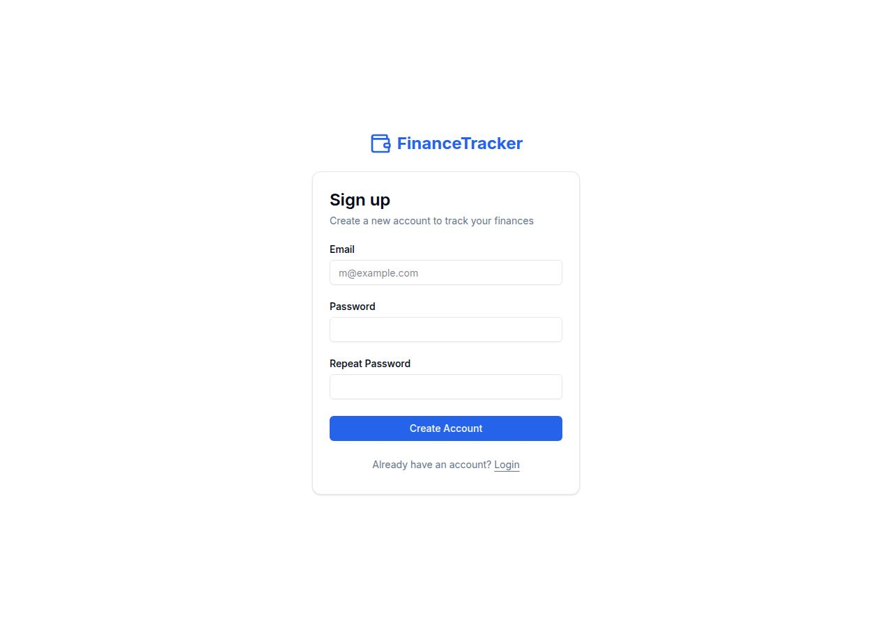
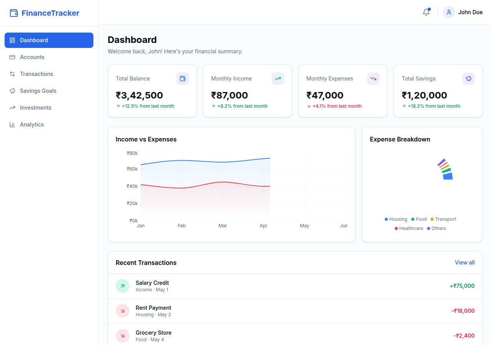
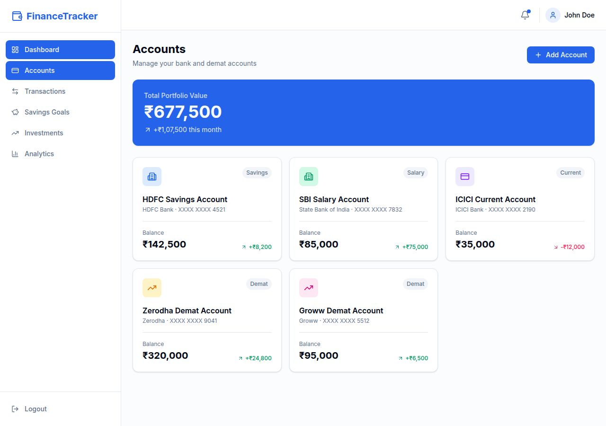
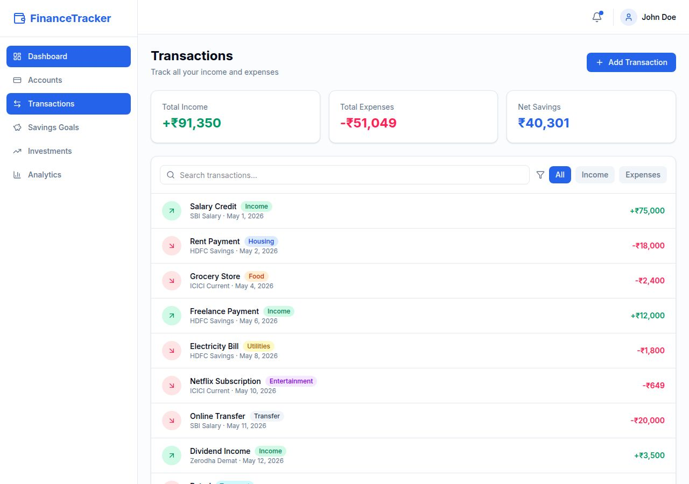
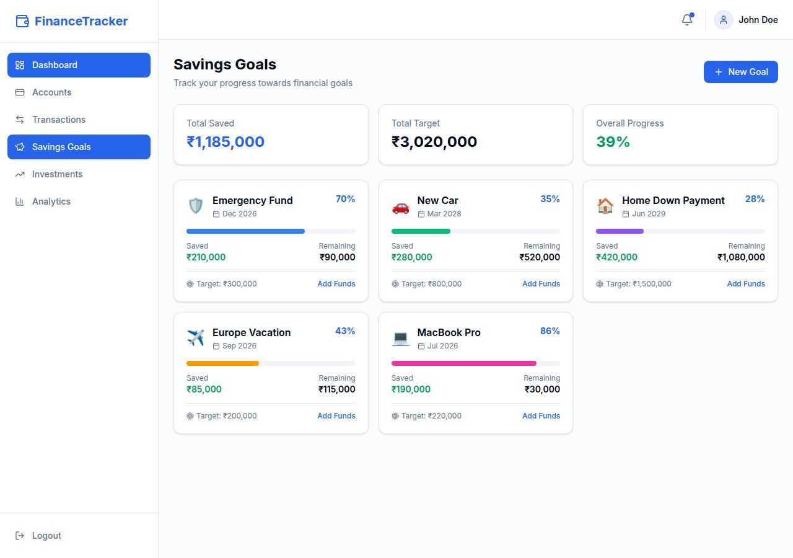
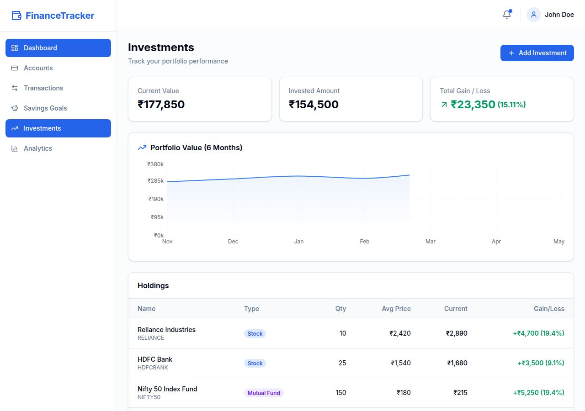
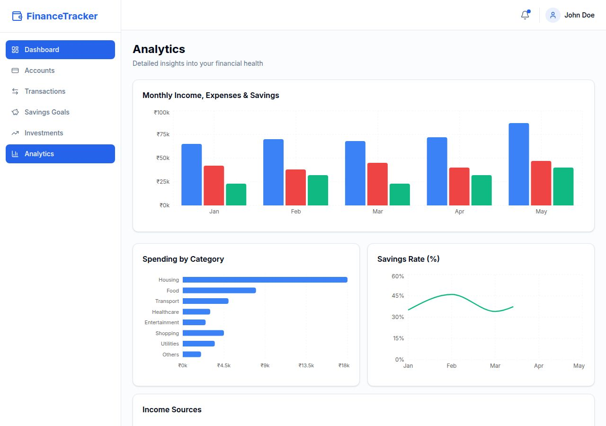

# FinanceTracker

A personal finance management web app to track income, expenses, savings, and investments across multiple bank and demat accounts — with monthly and yearly analytics.

## Screenshots

### Landing Page


### Login


### Sign Up


### Dashboard (Overview)


### Accounts


### Transactions


### Savings Goals


### Investments


### Analytics


## Features

- **Multiple Accounts** — Track multiple bank accounts and demat accounts in one place
- **Income Tracking** — Monitor all income sources with detailed categorization
- **Savings Goals** — Track savings and set financial goals with progress bars
- **Investment Tracking** — Monitor stock, mutual fund, and ETF portfolio performance
- **Analytics** — Get insights with monthly and yearly financial charts and reports
- **Secure** — Enterprise-grade security for your financial data

## Pages

| Route | Description |
|---|---|
| `/` | Landing page with hero, features, and CTA |
| `/auth/login` | Login form |
| `/auth/sign-up` | Sign-up form |
| `/dashboard` | Overview with stats, charts, and recent transactions |
| `/dashboard/accounts` | Bank and demat accounts with balances |
| `/dashboard/transactions` | Full transaction history with search and filter |
| `/dashboard/savings` | Savings goals with progress tracking |
| `/dashboard/investments` | Portfolio holdings and performance chart |
| `/dashboard/analytics` | Monthly income/expense/savings charts and breakdowns |

## Tech Stack

- **Frontend:** React 19, Vite, TypeScript
- **Styling:** Tailwind CSS with shadcn/ui design tokens
- **Routing:** Wouter
- **Charts:** Recharts
- **Icons:** Lucide React
- **Backend:** Express 5 (Node.js)
- **Database:** PostgreSQL + Drizzle ORM
- **Package Manager:** pnpm workspaces

## Getting Started

### Prerequisites

- Node.js 24+
- pnpm

### Install dependencies

```bash
pnpm install
```

### Run the development server

```bash
# Start the frontend
pnpm --filter @workspace/finance-tracker run dev

# Start the API server
pnpm --filter @workspace/api-server run dev
```

The app will be available at `http://localhost:19051/finance-tracker/`

### Typecheck

```bash
pnpm run typecheck
```

### Build

```bash
pnpm run build
```

## Project Structure

```
artifacts/
  finance-tracker/       # React + Vite frontend
    src/
      layouts/
        DashboardLayout.tsx  # Sidebar + header shell
      pages/
        Landing.tsx          # Landing page
        Login.tsx            # Login form
        SignUp.tsx           # Sign-up form
        Dashboard.tsx        # Overview stats & charts
        Accounts.tsx         # Bank & demat accounts
        Transactions.tsx     # Transaction history
        Savings.tsx          # Savings goals
        Investments.tsx      # Portfolio tracker
        Analytics.tsx        # Charts & reports
      App.tsx                # Router
      index.css              # Tailwind + CSS variables (blue theme)
  api-server/            # Express API server
    src/
      routes/            # API route handlers
lib/
  db/                    # Drizzle ORM schema & DB client
  api-spec/              # OpenAPI spec (source of truth)
  api-client-react/      # Generated React Query hooks
  api-zod/               # Generated Zod validation schemas
screenshots/
  landing.jpg
  login.jpg
  signup.jpg
  dashboard.jpg
  accounts.jpg
  transactions.jpg
  savings.jpg
  investments.jpg
  analytics.jpg
```

## Environment Variables

| Variable | Description |
|---|---|
| `DATABASE_URL` | PostgreSQL connection string |
| `SESSION_SECRET` | Secret key for session signing |
| `PORT` | Server port (set automatically by Replit) |
| `BASE_PATH` | Base URL path (set automatically by Replit) |

## Deployment

This project is hosted on Replit. Click **Publish** in the Replit interface to deploy to a `.replit.app` domain.

## License

MIT
